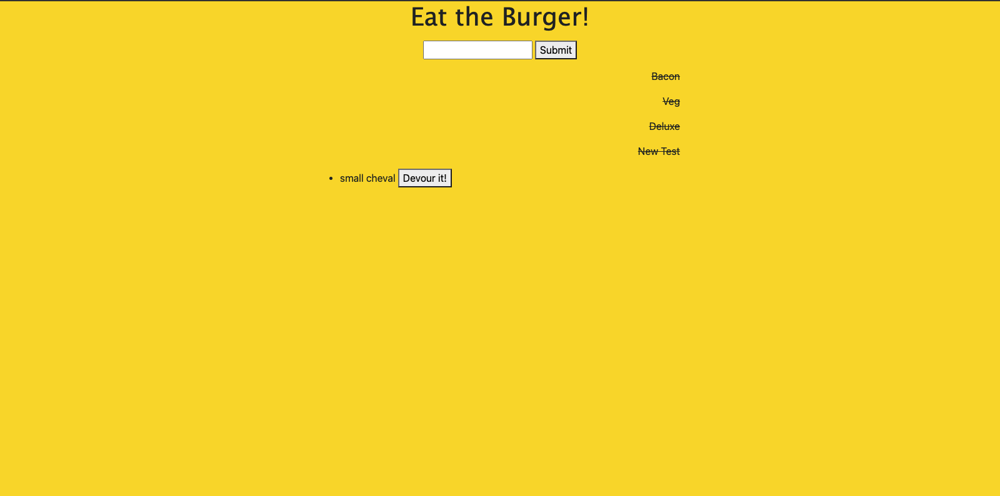

## Description

This app utilizes MySQL databases, express, and handlebars to render a list of devoured and non-devoured burgers for the user. 

## Screenshot of application

## Link to application
[Link](https://pacific-citadel-14201.herokuapp.com/)

# Table of Contents 

1. [Description](#Description)
 2. [Questions](#Questions?) 

 3. [Installation](#Installation) 

 4. [Usage](#Usage) 

 5. [Contributing](#Contributing) 

6. [License](#License) 

 7. [Tests](#Tests)